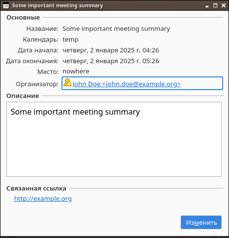

goical
=================================
[](https://pkg.go.dev/github.com/vodolaz095/goical?tab=doc)

Very simple [*.ics]((https://en.wikipedia.org/wiki/ICalendar)) file generator for Golang.
Generates local files and can be used for creating HTTP server responses.
At least calendars generated can be consumed by Mozilla Thunderbird




Example: generate local calendar
=================================

```go

package main

import (
	"log"
	"net/url"
	"os"
	"time"

	"github.com/vodolaz095/goical"
)

func main() {
	calendar := goical.New(time.Local)
	now := time.Now()
	u, _ := url.Parse("http://example.org")
	calendar.AddEvent(goical.Event{
		UID:         "today_with_john_doe",
		Timestamp:   time.Now(),
		Summary:     "Some important meeting summary",
		Description: "Some important meeting summary",
		Location:    "nowhere",
		URL:         u,
		Organizer: goical.Person{
			CommonName: "John Doe",
			Email:      "john.doe@example.org",
		},
		Start: now.Add(time.Minute),
		End:   now.Add(time.Hour),
	})

	err := calendar.Render(os.Stdout)
	if err != nil {
		log.Fatalf("error rendering: %s", err)
	}
}

```

Example: create endpoint returning calendars
=================================

```go

package main

import (
	"log"
	"net/http"
	"net/url"
	"time"

	"github.com/vodolaz095/goical"
)

func main() {
	http.HandleFunc("/holidays", func(writer http.ResponseWriter, request *http.Request) {
		writer.Header().Set("Content-Type", "text/calendar")
		err := goical.RussianHolidays(writer)
		if err != nil {
			log.Fatalf("error rendering: %s", err)
		}
	})

	http.HandleFunc("/today", func(writer http.ResponseWriter, request *http.Request) {
		writer.Header().Set("Content-Type", "text/calendar")
		calendar := goical.New(time.Local)
		now := time.Now()
		u, _ := url.Parse("http://example.org")
		calendar.AddEvent(goical.Event{
			UID:         "today_with_john_doe",
			Timestamp:   time.Now(),
			Summary:     "Some important meeting summary",
			Description: "Some important meeting summary",
			Location:    "nowhere",
			URL:         u,
			Organizer: goical.Person{
				CommonName: "John Doe",
				Email:      "john.doe@example.org",
			},
			Start: now.Add(time.Minute),
			End:   now.Add(time.Hour),
		})

		err := calendar.Render(writer)
		if err != nil {
			log.Fatalf("error rendering: %s", err)
		}
	})

	log.Fatal(http.ListenAndServe(":3000", http.DefaultServeMux))
}
```


License
=================

The MIT License (MIT)

Copyright (c) 2025 Ostroumov Anatolij <ostroumov095 at gmail dot com>

Permission is hereby granted, free of charge, to any person obtaining a copy of
this software and associated documentation files (the "Software"), to deal in
the Software without restriction, including without limitation the rights to
use, copy, modify, merge, publish, distribute, sublicense, and/or sell copies of
the Software, and to permit persons to whom the Software is furnished to do so,
subject to the following conditions:

The above copyright notice and this permission notice shall be included in all
copies or substantial portions of the Software.

THE SOFTWARE IS PROVIDED "AS IS", WITHOUT WARRANTY OF ANY KIND, EXPRESS OR
IMPLIED, INCLUDING BUT NOT LIMITED TO THE WARRANTIES OF MERCHANTABILITY, FITNESS
FOR A PARTICULAR PURPOSE AND NONINFRINGEMENT. IN NO EVENT SHALL THE AUTHORS OR
COPYRIGHT HOLDERS BE LIABLE FOR ANY CLAIM, DAMAGES OR OTHER LIABILITY, WHETHER
IN AN ACTION OF CONTRACT, TORT OR OTHERWISE, ARISING FROM, OUT OF OR IN
CONNECTION WITH THE SOFTWARE OR THE USE OR OTHER DEALINGS IN THE SOFTWARE.
